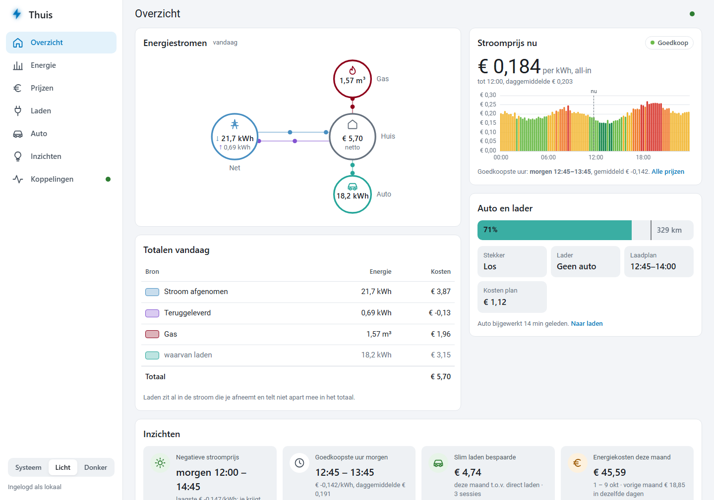
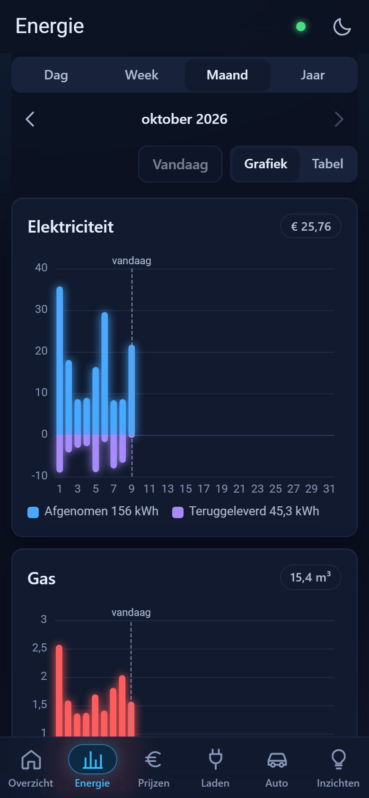
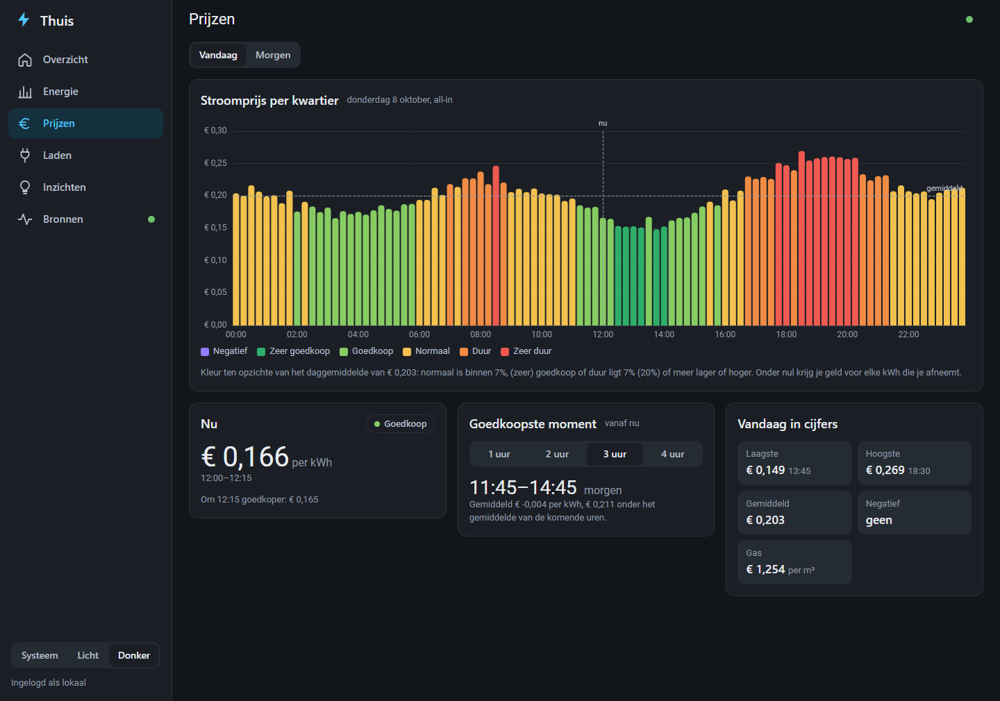
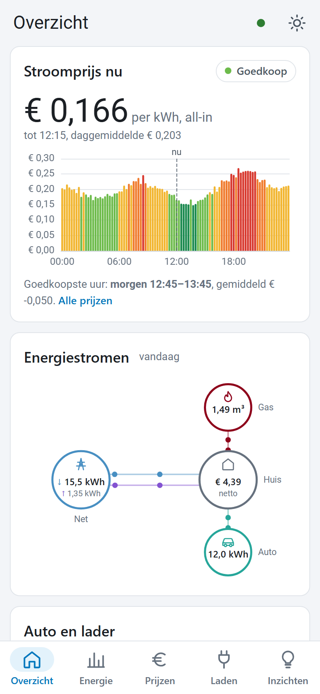

# Thuis — eigen energieplatform

Eén app voor stroom, gas, prijzen en het laden van de auto. Haalt de data zelf op bij
**Frank Energie**, **Easee** en **Kia/Hyundai Connect**, bewaart de historie in **BigQuery** en
draait volledig in **Google Cloud** achter je Google Workspace-login. Geen Home Assistant nodig.

```
Cloud Scheduler (elke 15 min)
  └─▶ Cloud Run-job  thuis-verzamel ──▶ Frank Energie · Easee · Kia · Open-Meteo
          │                         ──▶ Slim laden: lader pauzeren/hervatten (optioneel)
          ▼                         ──▶ Google Chat-meldingen (optioneel)
      BigQuery  (dataset thuis, EU)
          ▲
Cloud Run-service thuis-app  (API + web-app)  ◀── jij, ingelogd via IAP (Workspace-account)
```

## Wat het doet

| Pagina | Inhoud |
| --- | --- |
| Overzicht | Kosten en verbruik vandaag, prijs nu, accu, energiestromen, belangrijkste inzichten |
| Energie | Stroom, teruglevering, gas en laden per uur/dag/maand, met vergelijking t.o.v. vorige periode |
| Prijzen | All-in prijzen vandaag en morgen per kwartier, goedkoopste momenten, negatieve prijzen |
| Laden | Auto en lader live, laadplan (Slim laden), laadsessies met kosten, instellingen |
| Inzichten | Besparing door slim laden, kosten deze maand, gas t.o.v. vorige week (graaddagen), … |
| Koppelingen | Je accounts koppelen (Thuis bewaart alleen tokens, geen wachtwoorden) en de status per bron |

| Desktop (licht) | Mobiel (donker) |
| --- | --- |
|  |  |
|  |  |

*Schermafdrukken met de voorbeelddata uit `python -m thuis.demo`.*

**Slim laden** kiest de goedkoopste prijsblokken tot je vertrektijd, op basis van het accuniveau
van de auto. Automatisch sturen van de Easee staat standaard **uit**: zet het pas aan als het plan
een paar dagen klopt.

## Structuur

| Pad | Wat |
| --- | --- |
| `app/thuis/connectors/` | Frank Energie (GraphQL), Easee (REST), Kia/Hyundai (community-bibliotheek), Open-Meteo |
| `app/thuis/schema.py` | Alle tabellen op één plek, voor DuckDB én BigQuery |
| `app/thuis/opslag.py` | Opslaglaag: append-only, actuele stand per sleutel, alleen gewijzigde rijen erbij |
| `app/thuis/verzamel.py` | De verzamelaar: elke bron faalt los, uitslag per stap in de rondelog |
| `app/thuis/inzicht.py` | Dag- en periodeoverzichten (dag/week/maand/jaar), laden uit de meterstand van de lader |
| `app/thuis/sessies.py` | Laadsessies van inpluggen tot uitpluggen, met kosten en besparing t.o.v. direct laden |
| `app/thuis/inzichten.py` | Inzichten voor de overzichtspagina (negatieve prijzen, besparing, gas per graaddag, …) |
| `app/thuis/meldingen.py` | Google Chat-meldingen, elk maar één keer |
| `app/thuis/planner.py` · `laden.py` | Laadplanning en het sturen van de lader |
| `app/thuis/demo.py` | ±400 dagen realistische voorbeelddata met seizoenen |
| `app/thuis/api.py` | API (`docs/api.md`) en serveert de web-app |
| `app/web/` | Web-app zonder bouwstap (ES-modules + ECharts): zijbalk op desktop, tabbalk op mobiel, licht/donker, installeerbaar op je telefoon |
| `deploy/` | Eenmalige inrichting van Google Cloud (Cloud Shell) en beheerscripts |
| `docs/` | API-contract en deploy-handleiding |

## Lokaal draaien (zonder accounts)

```bash
cd app
pip install -e ".[dev]"
python -m thuis.demo                       # realistische voorbeelddata in thuis.duckdb
THUIS_AUTH_UIT=1 uvicorn thuis.api:app     # http://localhost:8000
pytest
```

Met echte accounts lokaal: koppel ze op de pagina Koppelingen (de tokens komen in
`thuis-kluis.json`), of zet `FRANK_EMAIL`, `FRANK_WACHTWOORD`, `EASEE_GEBRUIKER`, … (zie
`app/thuis/config.py`). Draai daarna `python -m thuis.verzamel`.

| Variabele | Waarvoor |
| --- | --- |
| `FRANK_EMAIL`, `FRANK_WACHTWOORD`, `FRANK_SITE` | Verbruik en kosten (prijzen zijn openbaar) |
| `EASEE_GEBRUIKER`, `EASEE_WACHTWOORD`, `EASEE_LADER` | Lader; `EASEE_LADER` alleen bij meer laders |
| `KIA_GEBRUIKER`, `KIA_WACHTWOORD`, `KIA_PIN`, `KIA_MERK` | Auto (`kia`, `hyundai` of `genesis`) |
| `THUIS_LAT`, `THUIS_LON` | Plaats voor het weer; standaard De Bilt |
| `GOOGLE_CHAT_WEBHOOK` | Meldingen in een Google Chat-ruimte; leeg = geen meldingen |
| `TOEGESTANE_EMAILS` | Wie de app mag gebruiken (naast IAP), komma-gescheiden |

Wat er na versie 1.0 nog op de lijst staat: **[docs/roadmap.md](docs/roadmap.md)**.

## Naar Google Cloud

Een eigen installatie voor iemand anders, stap voor stap en zonder voorkennis:
**[docs/eigen-installatie.md](docs/eigen-installatie.md)**.

Zie **[docs/deploy.md](docs/deploy.md)**: één script in Cloud Shell richt alles in; daarna
deployt elke merge naar `main` automatisch via GitHub Actions. Verwachte kosten: binnen de gratis
laag (er moet wel een betaalaccount aan het project hangen; het script zet een budgetalarm).

## Bekende grenzen

- **Kia/Hyundai** heeft geen officiële API. De community-bibliotheek volgt wijzigingen meestal
  snel; bij inlogproblemen is een update van `hyundai_kia_connect_api` vaak genoeg.
- **Verbruik** komt van de slimme meter via Frank Energie, met ongeveer een dag vertraging.
  Realtime verbruik (P1-meter) en zonnepanelen kunnen als connector worden toegevoegd zodra
  bekend is welke apparaten het zijn.
