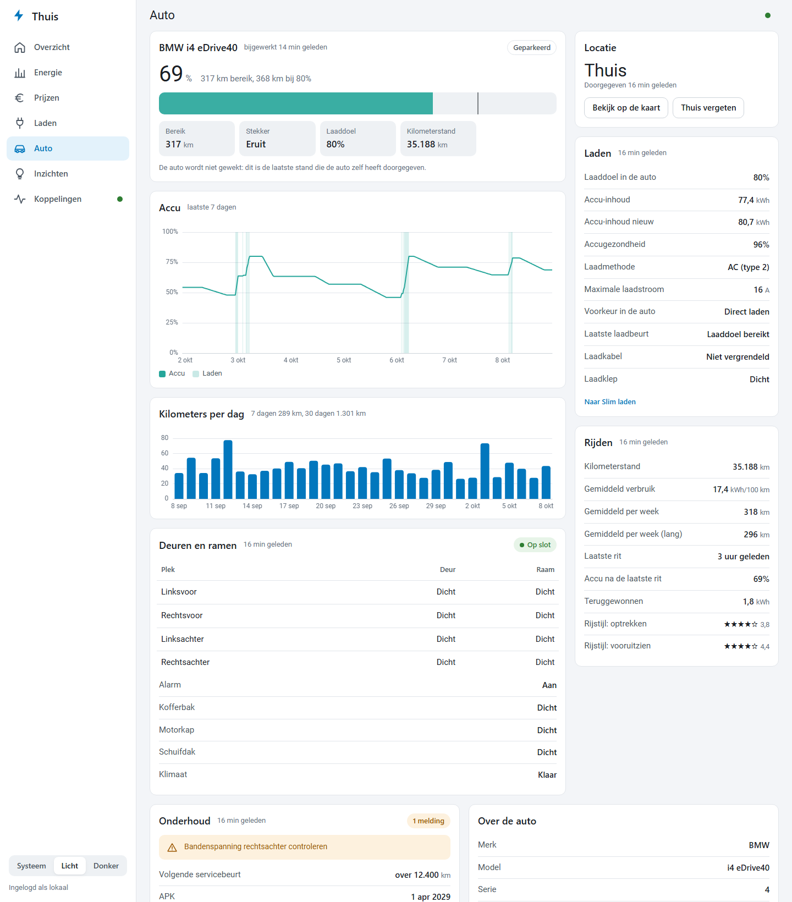
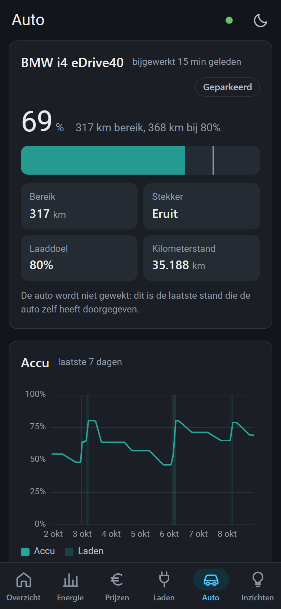
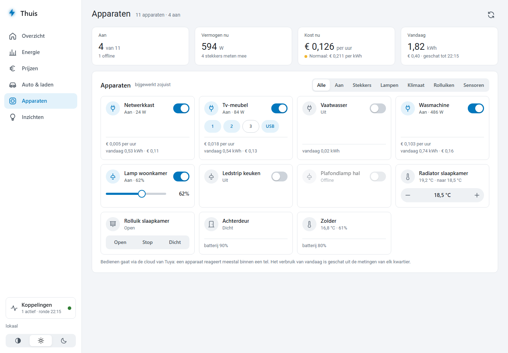
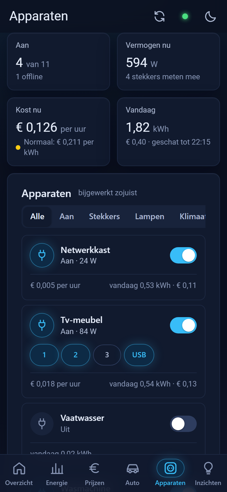
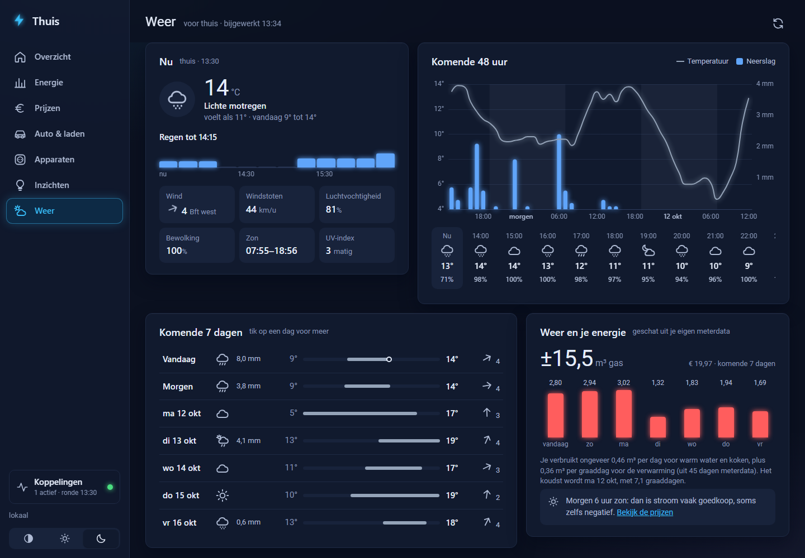
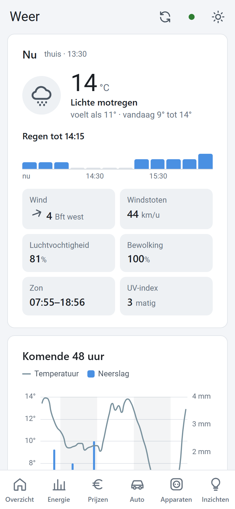

# Thuis — eigen energieplatform

Eén app voor stroom, gas, prijzen, het laden van de auto en je slimme apparaten. Haalt de data
zelf op bij **Frank Energie**, **Easee**, **Kia/Hyundai Connect**, **BMW CarData** en **Tuya** (Smart Life),
bewaart de historie in **BigQuery** en draait volledig in **Google Cloud** achter je Google
Workspace-login. Geen Home Assistant nodig.

```
Cloud Scheduler (elke 15 min)
  └─▶ Cloud Run-job  thuis-verzamel ──▶ Frank Energie · Easee · Kia of BMW · Tuya · Open-Meteo
          │                         ──▶ Slim laden: lader pauzeren/hervatten (optioneel)
          ▼                         ──▶ Google Chat-meldingen (optioneel)
      BigQuery  (dataset thuis, EU)
          ▲
Cloud Run-service thuis-app  (API + web-app)  ◀── jij, ingelogd via IAP (Workspace-account)
          └─▶ Tuya: apparaten live bekijken en bedienen
```

## Wat het doet

| Pagina | Inhoud |
| --- | --- |
| Overzicht | Kosten en verbruik vandaag, prijs nu, accu, energiestromen, belangrijkste inzichten |
| Energie | Stroom, teruglevering, gas en laden per uur/dag/maand, met vergelijking t.o.v. vorige periode |
| Prijzen | All-in prijzen vandaag en morgen per kwartier, goedkoopste momenten, negatieve prijzen |
| Laden | Auto en lader live, laadplan (Slim laden), laadsessies met kosten, instellingen |
| Auto | Alles wat de auto doorgeeft: accu en laden, kilometers per dag, onderhoud en bandenspanning, deuren en ramen, locatie, laadhistorie (ook onderweg) |
| Apparaten | Slimme stekkers, lampen, thermostaten, rolluiken en sensoren uit Smart Life of Tuya Smart: live stand, aan en uit, helderheid, temperatuur, wat ze nu per uur kosten en wat ze vandaag verbruikten |
| Inzichten | Besparing door slim laden, kosten deze maand, gas t.o.v. vorige week (graaddagen), … |
| Weer | Het weer voor thuis (Open-Meteo: KNMI, DWD, ECMWF): nu, regen per kwartier, 48 uur en 7 dagen, en het verwachte gasverbruik per dag uit je eigen meterdata. Op een telefoon via de kaart Weer op het overzicht |
| Koppelingen | Je accounts koppelen (Thuis bewaart alleen tokens, geen wachtwoorden) en de status per bron |

| Desktop (licht) | Mobiel (donker) |
| --- | --- |
|  |  |
|  |  |
|  |  |
|  |  |
|  |  |

*Schermafdrukken met de voorbeelddata uit `python -m thuis.demo` (apparaten: `THUIS_DEMO_APPARATEN=1`).*

**Slim laden** kiest de goedkoopste prijsblokken tot je vertrektijd, op basis van het accuniveau
van de auto. Automatisch sturen van de Easee staat standaard **uit**: zet het pas aan als het plan
een paar dagen klopt.

## Structuur

| Pad | Wat |
| --- | --- |
| `app/thuis/connectors/` | Frank Energie (GraphQL), Easee (REST), Kia/Hyundai (community-bibliotheek), BMW CarData (officiële API), Tuya (cloud-API, ondertekend), Open-Meteo |
| `app/thuis/schema.py` | Alle tabellen op één plek, voor DuckDB én BigQuery |
| `app/thuis/opslag.py` | Opslaglaag: append-only, actuele stand per sleutel, alleen gewijzigde rijen erbij |
| `app/thuis/verzamel.py` | De verzamelaar: elke bron faalt los, uitslag per stap in de rondelog |
| `app/thuis/inzicht.py` | Dag- en periodeoverzichten (dag/week/maand/jaar), laden uit de meterstand van de lader |
| `app/thuis/auto.py` | De pagina Auto: kilometers per dag, thuislocatie, laadhistorie van de auto |
| `app/thuis/weer.py` | De pagina Weer: verwachting voor thuis (afgerond op ±1 km), gas per graaddag uit je eigen meterdata |
| `app/thuis/apparaten.py` | De pagina Apparaten: codes van Tuya in gewone eenheden, opdrachten controleren, geschat verbruik |
| `app/thuis/sessies.py` | Laadsessies van inpluggen tot uitpluggen, met kosten en besparing t.o.v. direct laden |
| `app/thuis/inzichten.py` | Inzichten voor de overzichtspagina (negatieve prijzen, besparing, gas per graaddag, …) |
| `app/thuis/meldingen.py` | Google Chat-meldingen, elk maar één keer |
| `app/thuis/planner.py` · `laden.py` | Laadplanning en het sturen van de lader |
| `app/thuis/demo.py` | ±400 dagen realistische voorbeelddata met seizoenen |
| `app/thuis/api.py` | API (`docs/api.md`) en serveert de web-app |
| `app/web/` | Web-app zonder bouwstap (ES-modules + ECharts): zijbalk op desktop, tabbalk op mobiel, licht en donker (marine met neon), installeerbaar op je telefoon; foto's van auto's in `img/auto/` (zie `autoFoto` in `js/basis.js`) |
| `deploy/` | Eenmalige inrichting van Google Cloud (Cloud Shell) en beheerscripts |
| `docs/` | API-contract en deploy-handleiding |

## Lokaal draaien (zonder accounts)

```bash
cd app
pip install -e ".[dev]"
python -m thuis.demo                       # realistische voorbeelddata in thuis.duckdb
THUIS_AUTH_UIT=1 uvicorn thuis.api:app     # http://localhost:8000
pytest
```

Met echte accounts lokaal: koppel ze op de pagina Koppelingen (de tokens komen in
`thuis-kluis.json`), of zet `FRANK_EMAIL`, `FRANK_WACHTWOORD`, `EASEE_GEBRUIKER`, … (zie
`app/thuis/config.py`). Draai daarna `python -m thuis.verzamel`.

| Variabele | Waarvoor |
| --- | --- |
| `FRANK_EMAIL`, `FRANK_WACHTWOORD`, `FRANK_SITE` | Verbruik en kosten (prijzen zijn openbaar) |
| `EASEE_GEBRUIKER`, `EASEE_WACHTWOORD`, `EASEE_LADER` | Lader; `EASEE_LADER` alleen bij meer laders |
| `KIA_GEBRUIKER`, `KIA_WACHTWOORD`, `KIA_PIN`, `KIA_MERK` | Auto (`kia`, `hyundai` of `genesis`) |
| `THUIS_LAT`, `THUIS_LON` | Plaats voor het weer; standaard De Bilt |
| `GOOGLE_CHAT_WEBHOOK` | Meldingen in een Google Chat-ruimte; leeg = geen meldingen |
| `TOEGESTANE_EMAILS` | Wie de app mag gebruiken (naast IAP), komma-gescheiden |

Wat er na versie 1.0 nog op de lijst staat: **[docs/roadmap.md](docs/roadmap.md)**.

## Naar Google Cloud

Een eigen installatie voor iemand anders, stap voor stap en zonder voorkennis:
**[docs/eigen-installatie.md](docs/eigen-installatie.md)**.

Zie **[docs/deploy.md](docs/deploy.md)**: één script in Cloud Shell richt alles in; daarna
deployt elke merge naar `main` automatisch via GitHub Actions. Verwachte kosten: binnen de gratis
laag (er moet wel een betaalaccount aan het project hangen; het script zet een budgetalarm).

## Bekende grenzen

- **BMW CarData** staat 50 verzoeken per dag toe. Thuis vraagt de auto elk kwartier als hij laadt,
  elk half uur met de stekker erin en anders elk uur. Koppelen: maak in het CarData-portaal
  (My BMW → BMW CarData) een client aan met "CarData API" aan, en vul de client-ID in op de pagina
  Koppelingen. Daarna bevestig je een code op de site van BMW; je wachtwoord gaat niet via Thuis.
  De laadhistorie haalt Thuis één keer per dag op, model en bouwdatum één keer per week.
- **Tuya** werkt via de cloud van Tuya, met een eigen (gratis) cloudproject op platform.tuya.com
  waaraan je je Smart Life-account koppelt; de stappen staan bij het formulier op de pagina
  Koppelingen. Het proefabonnement (IoT Core) moet je om de paar maanden verlengen en heeft een
  maximum aantal verzoeken per maand. Daarom vraagt Thuis per ronde alle apparaten in één verzoek,
  bewaart het de live stand 15 seconden, en ververst de pagina Apparaten alleen zolang je hem
  gebruikt. Lokaal via de wifi bedienen kan vanuit Cloud Run niet.
- **Kia/Hyundai** heeft geen officiële API. De community-bibliotheek volgt wijzigingen meestal
  snel; bij inlogproblemen is een update van `hyundai_kia_connect_api` vaak genoeg.
- **Verbruik** komt van de slimme meter via Frank Energie, met ongeveer een dag vertraging.
  Realtime verbruik (P1-meter) en zonnepanelen kunnen als connector worden toegevoegd zodra
  bekend is welke apparaten het zijn.
